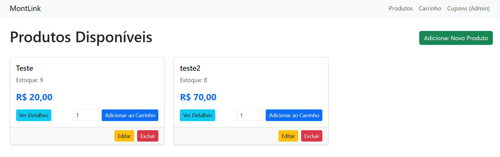

# MontLink E-commerce

Bem-vindo ao MontLink E-commerce! Este é um sistema de e-commerce básico desenvolvido com Laravel, focado em funcionalidades de gerenciamento de produtos, carrinho de compras e finalização de pedidos.

## Funcionalidades Principais

* **Gestão de Produtos:** CRUD completo para produtos (Criação, Leitura, Atualização e Exclusão).
* **Gestão de Estoque:** Controle básico de estoque associado aos produtos (e variações, se implementado).
* **Carrinho de Compras:** Adição e remoção de itens, cálculo de subtotal.
* **Finalização de Pedido:** Processo de checkout com dados do cliente e endereço.
* **Integração ViaCEP:** Consulta de CEP para preenchimento automático de endereço.
* **Gestão de Cupons:** CRUD para criação e gerenciamento de cupons de desconto.
* **Webhook de Pedidos:** Endpoint para notificações externas de status de pedidos (ex: gateway de pagamento).

## Pré-requisitos

Para executar este projeto, você precisará ter instalado:

* **Docker** e **Docker Compose** (recomendado para um ambiente de desenvolvimento consistente)
* Alternativamente, **PHP >= 8.1**, **Composer** e **MySQL** (ou outro banco de dados compatível) instalados diretamente no seu sistema operacional.

## Configuração e Instalação (Sem Docker / Ambiente Local)

Se você não for usar Docker, certifique-se de que PHP, Composer e um servidor web (Apache/Nginx) com MySQL estejam configurados.

1.  **Clone o Repositório:**
    ```bash
    git clone [URL_DO_SEU_REPOSITORIO] montlink-ecommerce
    cd montlink-ecommerce
    ```

2.  **Instale as Dependências do Composer:**
    ```bash
    composer install
    ```

3.  **Copie o Arquivo de Configuração de Ambiente:**
    ```bash
    cp .env.example .env
    ```

4.  **Gere a Application Key:**
    ```bash
    php artisan key:generate
    ```

5.  **Crie um Banco de Dados MySQL:**
    Crie um banco de dados vazio (ex: `montlink_db`) no seu servidor MySQL.

6.  **Configure o Banco de Dados no `.env`:**
    Abra o arquivo `.env` e configure as credenciais do seu banco de dados MySQL que você criou.

    ```dotenv
    DB_CONNECTION=mysql
    DB_HOST=127.0.0.1
    DB_PORT=3306
    DB_DATABASE=montlink_db # O nome que você criou
    DB_USERNAME=root        # Seu usuário MySQL
    DB_PASSWORD=            # Sua senha MySQL (vazio se não tiver)
    ```

7.  **Configure as Informações de E-mail para Desenvolvimento no `.env`:**
    Para ambiente local, é altamente recomendado usar um "email trap" como **Mailhog** (se estiver usando Laragon/Valet) ou **Mailpit**.

    Se estiver usando **Laragon**:
    Certifique-se de que o Mailhog/Mailpit está ativado no Laragon (geralmente em `http://localhost:8025`).
    ```dotenv
    MAIL_MAILER=smtp
    MAIL_HOST=localhost     # Ou 127.0.0.1
    MAIL_PORT=1025          # Porta padrão para Mailhog/Mailpit
    MAIL_USERNAME=null
    MAIL_PASSWORD=null
    MAIL_ENCRYPTION=null
    MAIL_FROM_ADDRESS="no-reply@montlink.com"
    MAIL_FROM_NAME="${APP_NAME}"
    ```

    Se não estiver usando Laragon, você pode instalar o Mailpit manualmente ou usar outro serviço similar.

8.  **Execute as Migrações do Banco de Dados:**
    ```bash
    php artisan migrate
    ```

9.  **Instale as Dependências de Frontend e Compile os Assets:**
    ```bash
    npm install
    npm run dev # ou npm run build
    ```

10. **Configure seu Servidor Web:**
    Configure seu Apache ou Nginx para apontar o `DocumentRoot` para a pasta `public` do projeto.

11. **Acesse a Aplicação:**
    Acesse a URL configurada no seu servidor web (ex: `http://montlink.test`).

## Testando as Rotas

Para verificar se todas as rotas foram carregadas corretamente, execute:
```bash
php artisan route:list
```

<hr>

## Imagem


## Contribuindo
Sinta-se à vontade para contribuir com este projeto. Por favor, crie um "fork" e envie um "pull request" com suas melhorias.

## Licença
Este projeto é de código aberto e licenciado sob a MIT License.